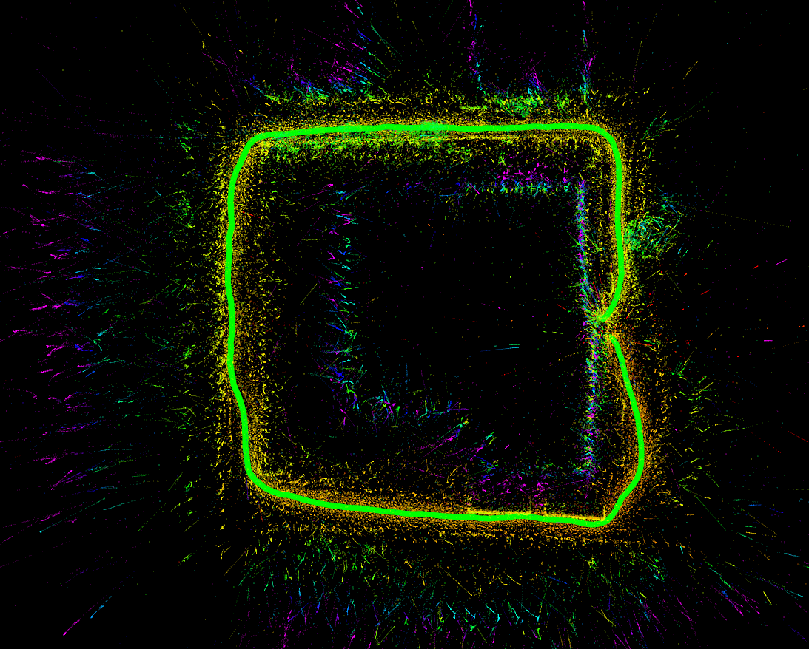

# panorama-based-OpenVINS 

**panorama-based-OpenVINS** is an visual-inertial system based on OpenVINS. We have adapted a panoramic camera model for OpenVINS.

## Features
* Support for panoramic cameras. Such as RICOH THETA Z1.
* Dynamic noise model for camera observations


## 1. Installation
Refer to the [installation guide](https://docs.openvins.com/gs-installing.html) of OpenVINS. Our code development on **Ununtu 18.04**.


## 2. Run with roslaunch

```shell
roslaunch ov_msckf subscribe.launch
```
To test on a personal dataset, see **config** in launch file.

## 3. Result
<div align="center">
    
</div>
We walk around the Xinghu Building of Wuhan University and return to the original point. MSCKF Points and SLAM Points are colored with RBG.

## 4. Reference
[OpenVINS](https://docs.openvins.com/),[OpenVSLAM](https://github.com/xdspacelab/openvslam)